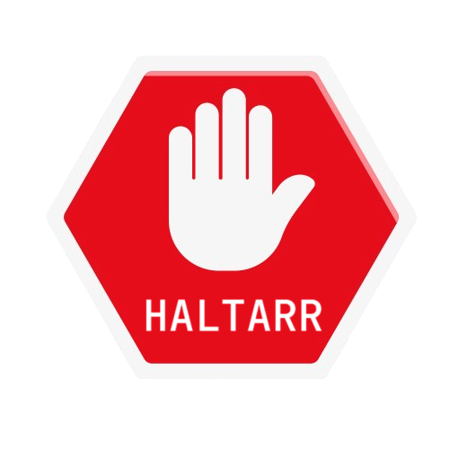

<p align="center">
  
</p>

# Controllarr

**Controllarr** is a Python Flask-based service that pauses or resumes download clients (SABnzbd, Deluge) when media is played or stopped in Jellyfin. It also notifies Discord of these events via webhooks.

## Features
- Pauses/Resumes SABnzbd and Deluge download clients based on media playback in Jellyfin.
- Sends notifications to Discord.
- Automatically builds and deploys as a Docker image via GitHub Actions.

## Setup

### Environment Variables
- `DISCORD_WEBHOOK_URL`: Your Discord webhook URL to send notifications.
- `SABNZBD_API_KEY`: API key for SABnzbd.
- `DELUGE_HOST`: Host for Deluge.
- `DELUGE_PORT`: Port for Deluge.
- `DELUGE_USERNAME`: Username for Deluge.
- `DELUGE_PASSWORD`: Password for Deluge.

### Running the app locally
1. Install the dependencies:
   ```bash
   pip install -r requirements.txt
   ```
2. Run the app:
    ```bash
    python app.py
    ```

### Running with Docker
Build and run the Docker container:
```bash
    docker build -t eralumin/controllarr .
    docker run -d -p 5000:5000 --env-file .env eralumin/controllarr
```

## Deployment with GitHub Actions
Automatically builds a new Docker image on every push to main and increments the version.
The image is pushed to Docker Hub under eralumin/controllarr.
